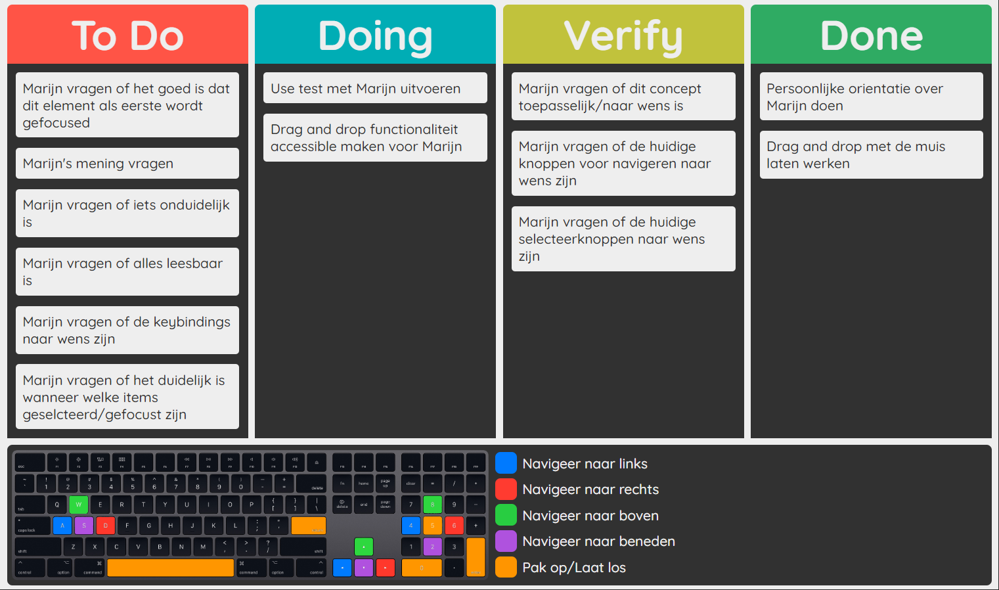
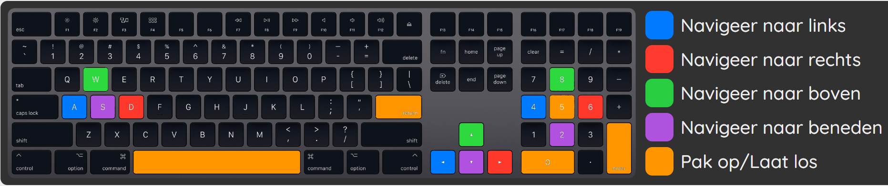
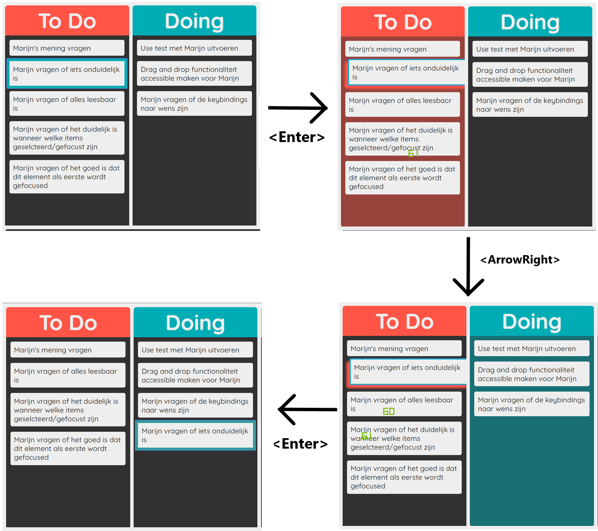

# Accessible Drag and Drop
This is a SCRUM board specifically designed for Marijn. Marijn is motor impaired and sometimes has trouble navigating websites. This app's core functionality is drag and dropping items from board to board. Normally this action is done by mouse, but with this scrum board you can also use your keyboard. For more info see: [Use case about Marijn](#Use case about Marijn)



## Demo's

[Live Demo](https://meessour.github.io/web-design-1920/)

## Table of Contents
1. [How to install](#How-to-install)
2. [Use case about Marijn](#Use-case-about-Marijn)
3. [Design Principles](#Design-Principles)
4. [How does it work](#How-does-it-work)
5. [Feedback sessions](#Feedback-sessions)
6. [Wishlist](#Wishlist)
7. [License](#License)

## How to install

**Step 1:** Clone project:
```git
git clone https://github.com/meessour/web-design-1920.git
```

**Step 2:** Open index.html in your browser

## Use case about Marijn
This app is specifically made for the wishes of Marijn. Marijn is a developer and father of two. People describe him as a lovely man and hard-working. He describes himself as skilled, critical and analytic. You listens to Metal music and can be found in moshpits. Marijn has a condition where his muscles are weakened and where he lacks muscle control, it is called motor impairment. Because of this he sometimes has trouble using certain features on websites because they are not made for him. This app is specifically made for him, down below research results about Marijn.
 
Marijn's Pc is a macbook and uses google chrome as web browser. He has a iPhone X as phone which runs iOs. For commands on his PC (like CRTL + TAB) he uses sticky keys because he has trouble holding down multiple keys at the same time. He uses his left hand to use the keyboard. Prefers keys on the right side of the keyboard like numpad, shift, enter, spacebar and the arrow keys. During our first meeting he was unconsciously drawn to using the arrow keys for navigating. Using the arrow keys is therefore the primary way of navigating in this app. He uses his thumb for the trackpad.

Because Marijn is a developer himself, I decided to make him a SCRUM board. The agile working method is very common among developers and a SCRUM board is needed for this.

## Design Principles
Because I can't exactly empathize with Marijn's disability, I have to research what works best for him. I can't base my research on existing design principles because they are made for abled people, so I have to come up with something else. A good way of doing my research is by following [**The 4 Exclusive Design Principles (By Vasilis)**](https://exclusive-design.vasilis.nl/). These principles are: **Study situation**, **Ignore conventions**, **Prioritise identity**, **Add nonsense**.

The first point is **studying the person in question** and how to app will be used by that person. In what situation is the app going to be used and how will it be navigated. The study about Marijn can be found here: [Use case about Marijn](#Use case about Marijn).

The second point is **ignoring conventions**. The current conventions are made by, and this for designers, not specifically for disabled people. In this case certain principles should be dropped because they are not suitable for the person in question, Marijn. The tab key for example. Usually the user should be able to tab though every item, but for Marijn it is not preferred to use this key. So not making the tab functionality fully functional is not priority. A convention specifically meant for Marijn is a priority in this case, instead of the usual principles.

The third point is **prioritising identity**. The app is made for Marijn, and the best way of designing it correctly is by involving the person in question. Not designing it **for** Marijn but designing it **with** Marijn. In order to accomplish this I plan on having a weekly meeting with Marijn to test **with** Marijn and actively observe.

The fourth and last point is **adding nonsense**. Sometimes the best solution is not in hindsight and needs to be discovered. A good way of doing this is by adding a concept you wouldn't normally add to your app. There is a change that it actually is nonsense and is not practical, but maybe you find something that can be used as a functional concept. Because Marijn has a lack of muscle, navigating a PC can be tiring for him. Instead of manually navigating with the arrow keys, I plan on adding a functionality where the user doesn't even have to use the keys. My "nonsense" concept is an automatic navigation that changes focus every specified period of time.

The app should should meet these specifications:
* The user is able to set focus on an item using only the keyboard.
* The user is able to move to an item on the right, left, above and below using only the keyboard.
* The user can easily understand how the controls work, these should also be intuitive.
* The user should be able to distinguish not-focused items from focused items.
* The user should be able to distinguish not-focused items from grabbed items.
* The user should be able to distinguish focused items from grabbed items.
* The user should know which board is hovered over when holding an item.
* The user should know how to drop an item.
* The user should be able to easily recover if something goes wrong.

## How does it work
This is what the website looks like:


There are four board where an item can be placed. These board are To-Do, doing, Verify and Done. These board are usually used with SCRUM. 

At the bottom is a comprehensive navigation guide with a mac keyboard layout, this is because Marijn uses a MacBook. I implemented navigation keys on the right side of the keyboard because that's what Marijn preferred. The guide is in Dutch because that is his main spoken language. Here is an enlarged image of the navigation guide:



In order to move an item, Marijn must first set focus on an item. When entering the site, the first item is standard in focus. Once Marijn has chosen an item he wants to move, he clicks the hold/release button. Now the app is in the state of holding an item, this is indicated by the box shadow of an item and the background of the board being a different color. Marijn can now change the board to hover over by navigating left or right. The background of the board changes when it is hovered over. Once the wanted board is hovered over, Marijn can press the hold/release button. Now the item is moved to the specified board and focus is set on the item that has been moved. Here is a wireframe of this action:



## Feedback sessions

<details>  
    <summary>Week 1</summary>
    
#### Questions

* What do you think of the overall look?
    * Is there some visual aspect you would like to be changed?
* The first item is now standard in focus, do you like that?
* Is everything clear and readable?
    * Do you like the font?
* Do you like the keybindings?
    * Is it clear and intuitive on how to navigate?
    * Would you like an extra (set of) keybind(s)?
    * Would you like to remove one of the keybinds?
* Are the different states where an item can be in clear?
    * Is it clear when an item is in focus and when it's not?
    * Is it clear when an item is held?
* Do you have any points of improvements?

</details>


## Wishlist
* Cancel picking up an item and return to state it was in before
* Add your own items
* Delete/archive items
* Remember the state where the board was in previously.
* Make app work on mobile
* Make app work on more devices

## License
This repository is licensed as [MIT](LICENSE) @ [Mees Sour](https://github.com/meessour).
