# Accessible Drag and Drop
This is a SCRUM board specifically designed for Marijn. Marijn is motor impaired and sometimes has trouble navigating websites. This app's core functionality is drag and dropping items from board to board. Normally this action is done by mouse, but with this scrum board you can also use your keyboard. For more info see: [User Scenario (Marijn)](#user-scenario-marijn)

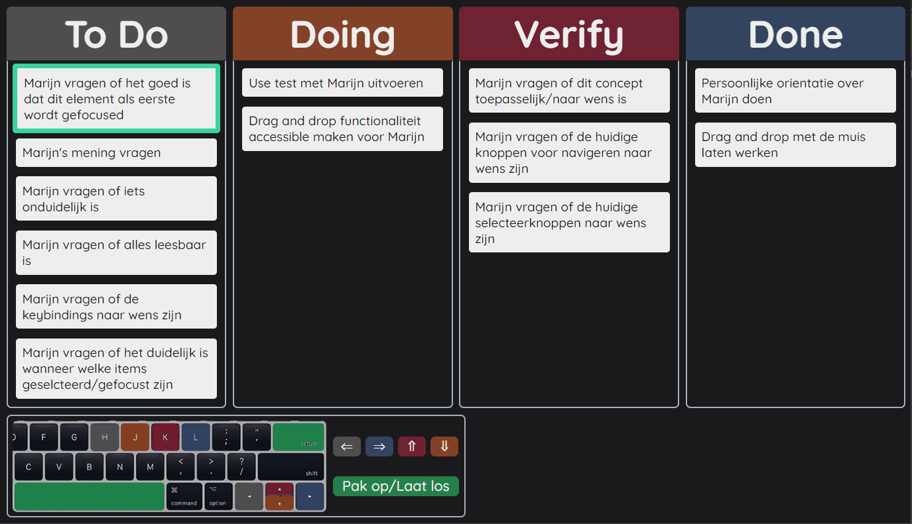

<details>  
    <summary>V1</summary>
    


</details>  


## Demo's

[Live Demo](https://meessour.github.io/web-design-1920/)

## Table of Contents
1. [How to install](#How-to-install)
2. [User Scenario (Marijn)](#user-scenario-marijn)
3. [Design Principles](#Design-Principles)
4. [How does it work](#How-does-it-work)
5. [Feedback sessions](#Feedback-sessions)
6. [Wishlist](#Wishlist)
7. [License](#License)

## How to install

**Step 1:** Clone project:
```git
git clone https://github.com/meessour/web-design-1920.git
```

**Step 2:** Open index.html in your browser

## User Scenario (Marijn)
This app is specifically made for the wishes of Marijn. Marijn is a developer and father of two. People describe him as a lovely man and hard-working. He describes himself as skilled, critical and analytic. You listens to Metal music and can be found in moshpits. Marijn has a condition where his muscles are weakened and where he lacks muscle control, it is called motor impairment. Because of this he sometimes has trouble using certain features on websites because they are not made for him. This app is specifically made for him, down below research results about Marijn.
 
Marijn's Pc is a macbook and uses google chrome as web browser. He has a iPhone X as phone which runs iOs. For commands on his PC (like CRTL + TAB) he uses sticky keys because he has trouble holding down multiple keys at the same time. He uses his left hand to use the keyboard. Prefers keys on the right side of the keyboard like numpad, shift, enter, spacebar and the arrow keys. During our first meeting he was unconsciously drawn to using the arrow keys for navigating. Using the arrow keys is therefore the primary way of navigating in this prototype. He uses his thumb for the trackpad.

Because Marijn is a developer himself, I decided to make him a SCRUM board. The agile working method is very common among developers and a SCRUM board is needed for this.

## Design Principles
Because I can't exactly empathize with Marijn's disability, I have to research what works best for him. I can't base my research on existing design principles because they are made for abled people, so I have to come up with something else. A good way of doing my research is by following [**The 4 Exclusive Design Principles (By 3)**](https://exclusive-design.vasilis.nl/). These principles are: **Study situation**, **Ignore conventions**, **Prioritise identity**, **Add nonsense**.

The first point is **studying the person in question** and how to app will be used by that person. In what situation is the app going to be used and how will it be navigated. The study about Marijn can be found here: [User Scemario (Marijn)](#user-scenario-marijn).

The second point is **ignoring conventions**. The current conventions are made by, and this for designers, not specifically for disabled people. In this case certain principles should be dropped because they are not suitable for the person in question, Marijn. The tab key for example. Usually the user should be able to tab though every item, but for Marijn it is not preferred to use this key. So not making the tab functionality fully functional is not priority. A convention specifically meant for Marijn is a priority in this case, instead of the usual principles.

The third point is **prioritising identity**. The prototype is made for Marijn, and the best way of designing it correctly is by involving the person in question. Not designing it **for** Marijn but designing it **with** Marijn. In order to accomplish this I plan on having a weekly meeting with Marijn to test **with** Marijn and actively observe.

The fourth and last point is **adding nonsense**. Sometimes the best solution is not in hindsight and needs to be discovered. A good way of doing this is by adding a concept you wouldn't normally add to your prototype. There is a change that it actually is nonsense and is not practical, but maybe you find something that can be used as a functional concept. Because Marijn has a lack of muscle, navigating a PC can be tiring for him. Instead of manually navigating with the arrow keys, I plan on adding a functionality where the user doesn't even have to use the keys. My "nonsense" concept is an automatic navigation that changes focus every specified period of time.

The prototype should should meet these specifications:
* The user is able to set focus on an item using only the keyboard.
* The user is able to move to an item on the right, left, above and below using only the keyboard.
* The user can easily understand how the controls work, these should also be intuitive.
* The user should be able to distinguish not-focused items from focused items.
* The user should be able to distinguish not-focused items from grabbed items.
* The user should be able to distinguish focused items from grabbed items.
* The user should know which board is hovered over when holding an item.
* The user should know how to drop an item.
* The user should be able to easily recover if something goes wrong.

## How does it work
This is what the website looks like:


<details>  
    <summary>V1</summary>
    


</details>  


There are four board where an item can be placed. These board are To-Do, doing, Verify and Done. These board are usually used with SCRUM. 

At the bottom is a comprehensive navigation guide with a mac keyboard layout, this is because Marijn uses a MacBook. I implemented navigation keys on the right side of the keyboard because that's what Marijn preferred. The guide is in Dutch because that is his main spoken language. Here is an enlarged image of the navigation guide:

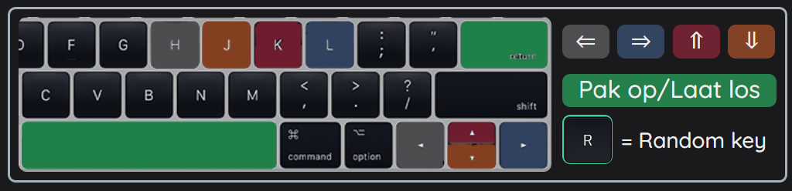

<details>  
    <summary>V1</summary>
    


</details>  

In order to move an item, Marijn must first set focus on an item. When entering the site, the first item is standard in focus. Once Marijn has chosen an item he wants to move, he clicks the hold/release button. Now the prototype is in the state of holding an item, this is indicated by the box shadow of an item and the background of the board being a different color. Marijn can now change the board to hover over by navigating left or right. The background of the board changes when it is hovered over. Once the wanted board is hovered over, Marijn can press the hold/release button. Now the item is moved to the specified board and focus is set on the item that has been moved. Here is a wireframe of this action:

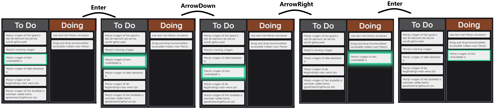

<details>  
    <summary>V1</summary>
    


</details>  

## Feedback sessions

<details>  
    <summary>Week 1</summary>
    
#### Questions and answers

* Would you like to see a different set of keybindings?
    * Yes, I'd like to see the key combination HJKL. It is a classic way of navigating via keyboard"

* Should I remove one or more sets of keybindings?
    * No, you can keep the current keybindings.
    
    During the test I saw that his laptop (Macbook Pro) did not have a numpad. This meant that those keybindings were not able to be used by him. In the first version of my prototype I had a image of a Mac keyboard and a corresponding legend with all the controls. I used a keyboard iamge WITH numpad, in the next version of the prototype I will use an image that perfectly matches his current keyboard layout. This way it is even more personalised. 

#### Improvements for V2 of the prototype
Here are points listed from own observations, feedback from Marijn for me and feedback from Marijn to other's. These are the points that I got from my own questions, but also from observing him via webcam and feedback he gave to others.

* Add the HJKL key bindings
* Simplify the key bindings guide at the bottom of the screen. In version 2, the WASD and numpad bindings will be removed.
* Change the keyboard used in the guide in order to match his personal keyboard layout.
* Add the functionality to move items up and down in the same board.
* The shifting colors while an item is in focus was distracting and should be changed.
* Colors during animations/interactions are distracting and should be removed
* Change the overall color pallet to something "punk" (A term Vasilis used) or something more darker. He likes the music genre: "metal", where dark color are a common theme, so that's something to be aware of.
* He had to laugh at metal/punk-related styling so I will add something related to this. My plan is to add a .favicon that is related to that.

#### Extra things I observed

At almost every test he was drawn to the arrow keys and those keys seemed familiar to him. This may also be the case for other people, so using these bindings seemed really good! User tests with other people should be done to verify this.

Initially I wanted to enlarge the size of fonts and components in the prototype, but I changed my mind after the tests. In more than half of the others feedback he mentioned that visual properties were too large. He also didn't give me feedback related to the size of the UI, so I wont change that in version 2.

</details>

<details>  
    <summary>Week 2</summary>
    
#### Questions and answers

* How do you like the new color scheme of the app?
    - I think it looks good
* What do you think of the new random button?
    - I think It's a fun feature  
* Is there anything you would change for the current design?
    - No, it looks good with the new color palette 
* Was/is it clear what all the controls are?
    - Yes, the controls are clear.
* Last week you told me that you didn't like the shifting colors on focused items, is the current implementation to your liking?
    - Yes, it is much less distracting now.
* Last week you told me that you want to see a functionality to move items up and down in a board, is the current implementation to your liking?
    - Yes, but items do not wrap around when I reach the bottom/top. It does wrap around when I am not holding an item. I would like to see consistency in this feature.
* What do you think of the favicon/app icon?
    - It is fun.
    
#### Extra things I observed

Concerning the random key feature; Marijn said he had to try a few times to get an item to the right board, but he thinks the feature is fun. Also, the first 30 seconds I didn't have my microphone working and he  quickly found out, by himself, how to random key feature works. This means he found the controls by himself and understands what it does without having to explain it. At last, he had to laugh when he tried the feature for the first time, i'm happy he did.

Marijn told me he liked the small guide on the bottom of the screen, but he would've preferred if the menu hides it self after a few seconds. And be able to show the menu again with the keybind "SHIFT + FORWARD SLASH" (question mark).

#### Improvements for V3 of the prototype

* Be able to wrap a grabbed item around when moving up and down.
* Let the board hide it self after a period of time.
* Be able to hide/show the control guide with the command: SHIFT + FORWARD SLASH.

</details>


## Changes For new version

<details>  
    <summary>V1 - V2</summary>


Every change made here is from the feedback I got during week 1. Go to [Feedback sessions](#Feedback-sessions) week 1 to see the results of this test
    
#### Changed keybindings
I added the keybindings HJKL as extra navigation way. 
* H represents **Navigate left**
* J represents **Navigate down**
* K represents **Navigate up**
* L represents **Navigate rigth**

Source: [Wikipedia HJKL keys](https://en.wikipedia.org/wiki/Arrow_keys#HJKL_keys).

I removed the numpad keybindings and the WASD keybindings.

This is what the new layout looks like:


<details>  
    <summary>V1</summary>
    


</details>  

#### Changed color pallet
The overall color scheme in V2 of the prototype is a bit darker.


<details>  
    <summary>V1</summary>
    


</details>  

#### Changed focus/grabbed state style
I changed the look of the hover and grabbed state. The new focus state won't shift colors from blue to red. It is now just solid mint green:

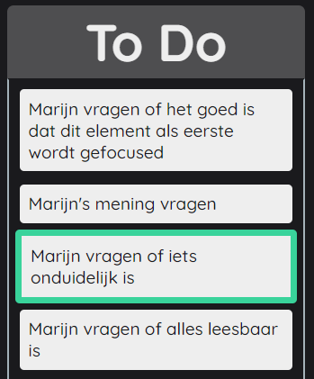

<details>  
    <summary>V1</summary>
    
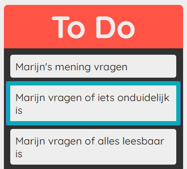

</details>  

The grab state now has a mint green box-shadow:

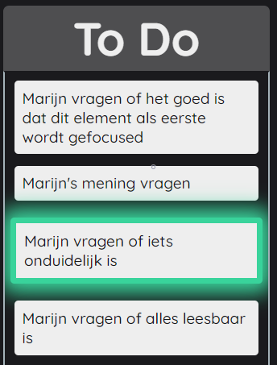

<details>  
    <summary>V1</summary>
    
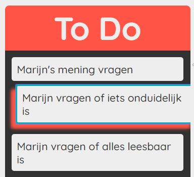

</details>

#### Added functionality to move items up and down

Items can now be moved up and down in a board:

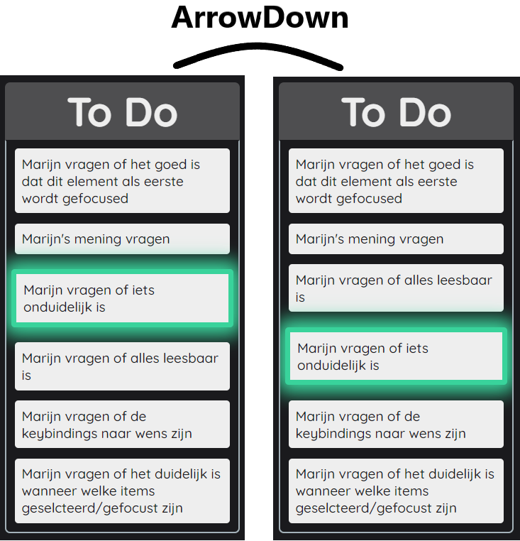
  
#### Added .favicon
I added a favicon with a punk/rock style as an "easteregg"

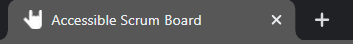

#### (Nonsense) Added functionality to randomly place an item
By pressing one of the random key (bound to the key: "KeyR"), you can place the currently selected/grabbed item on a random board. A random board node is generated from a predefined list. If the randomly generated board node is the current focused board node, then another random board is generated. Eventually the selected/grabbed item is moved to that board.

```javascript
let randomBoardNode;

do {
    // Get a random board node. Repeat if board is the same as the current selected board
    randomBoardNode = boardNodes[Math.floor(Math.random() * boardNodes.length)];
} while (randomBoardNode === currentFocusedBoardNode);
```

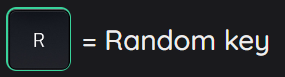

</details>  

<details>  
    <summary>V2 - V3</summary>

## Changes from V2 to V3

Every change made here is from the feedback I got during week 2. Go to [Feedback sessions](#Feedback-sessions) week 2 to see the results of this test

#### Keyboard hide/show feature
Marijn requested to hide the keyboard after a while. He said that he knew the controls already and it was unnecessary to keep on the screen. Now the "guide" hide itself after 5 seconds.

```javascript
setTimeout(function () {
document.getElementById("explanation-board").style.animation = "hideGuideElementVisibility 2s forwards";

}, 5000);
```

To show the guide again (or to hide it), the question mark needs to be clicked. This can be performed by pressing "SHIFT + /". I asked Marijn what keybinding he would like, and this is what he came up with.

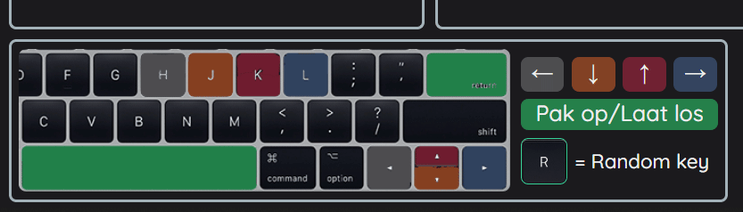

#### Wrap items around on same board
Previously it wasn't possible to wrap items around vertically while holding an item. Now this is possible. I need to do a check if another item is present in the board, otherwise there is nothing to wrap around. This is the code for checking that:

```javascript
// A check if another element is present in the current board
else if (currentLiftedItemNode.nextElementSibling) {
    currentFocusedBoardNode.appendChild(currentLiftedItemNode)
}
```

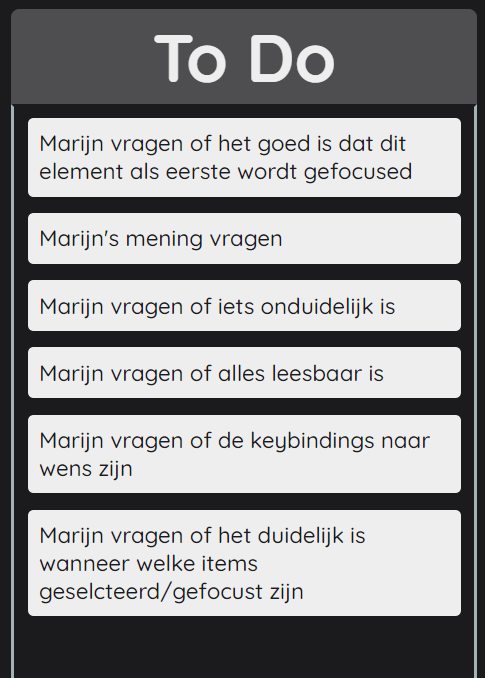

</details>  

## Do's and don't during testing with Marijn
One of the most important things with testing with Marijn, is observing how he uses his laptop/PC. The way he likes to use the keyboard (for example), isn't always verbally communicated. Because of this it is really important to be physically with him or have someone there to observe him for the tester (what Vasilis did). 

Because Marijn has trouble speaking, it is really important to not interrupt him while he is talking. It is also really important to listen carefully what he is saying, verbally and non-verbally. You can pick up his opinion about something in the way his voice changes (acknowledgement in higher pitched voice for example).

What I learned from Vasilis is that he doesn't like it when things are unprepared. He became grumpy after the students not being prepared last year. This is why I decided to have questions prepared and a strategy.

#### Do's
* Observe the way he uses his laptop/pc
* Be prepared with questions
* Listen carefully (non-verbally too) in order to truly understand him

#### Don'ts
* Don't interrupt Marijn when he is talking
* Be unprepared or not aware what you are talking about

## Wishlist
* Cancel picking up an item and return to state it was in before
* Add your own items
* Delete/archive items
* Remember the state where the board was in previously.
* Make prototype work on iPhone (Marijn has an iPhone)
* Make prototype work on more devices

## License
This repository is licensed as [MIT](LICENSE) @ [Mees Sour](https://github.com/meessour).
